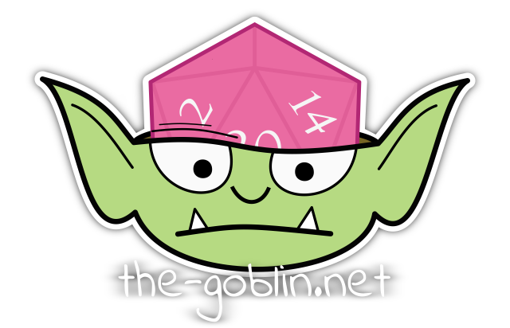
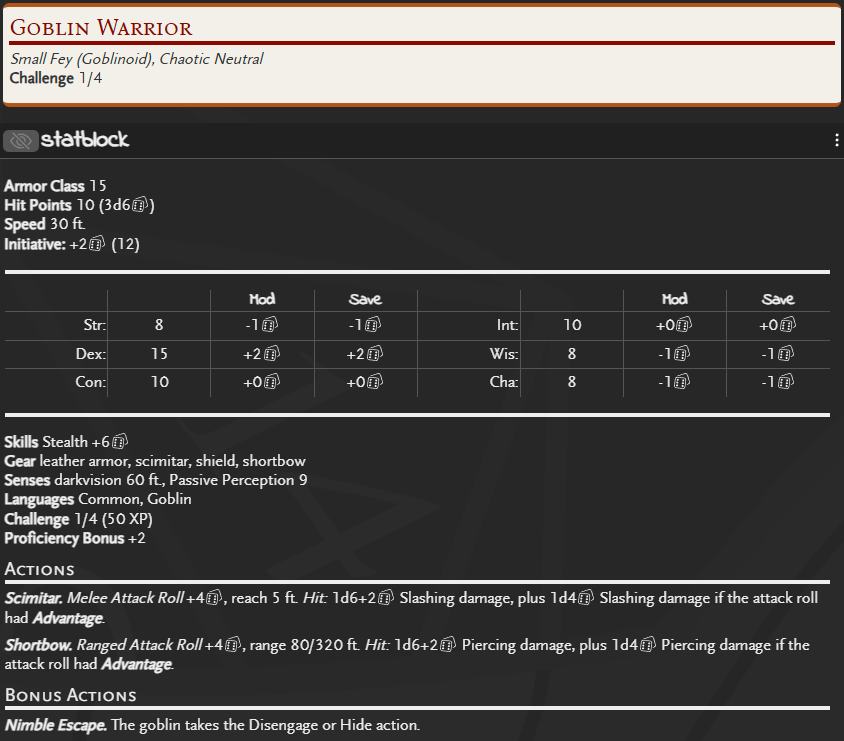

# The Goblin's 5e SRD

Dungeons and Dragons 5th edition (2024 edition) SRD content in .tgn format (for import into [The Goblin's Notebook](https://www.the-goblin.net)).

## Example Output

## Using These Files

Download any of the files and import them imto you campaign from the campaign preferences panel. You can download either individual creatures or the entire collection in one file.

### Collection

Download the entire collection of creatures

- 2014: [creatures-srd-category.tgn](creatures-srd-category.tgn)
- 2024: [creatures-srd-2024-category.tgn](creatures-srd-2024-category.tgn)

### Individual Creatures

Download individual .tgn files per creature

- 2014: [creatures/srd](creatures/srd)
- 2024: [creatures/srd-2024](creatures/srd-2024)

## Licences

### 2014 Edition: SRD v5.1

This work includes material taken from the System Reference Document 5.1 ("SRD 5.1") by Wizards of the Coast LLC and available at https://dnd.wizards.com/resources/systems-reference-document. The SRD 5.1 is licensed under the Creative Commons Attribution 4.0 International License available at https://creativecommons.org/licenses/by/4.0/legalcode.

### 2024 Edition: SRD v5.2.1

This work includes material from the System Reference Document 5.2.1 (“SRD 5.2.1”) by Wizards of the Coast LLC, available at https://www.dndbeyond.com/srd. The SRD 5.2.1 is licensed under the Creative Commons Attribution 4.0 International License, available at https://creativecommons.org/licenses/by/4.0/legalcode.
